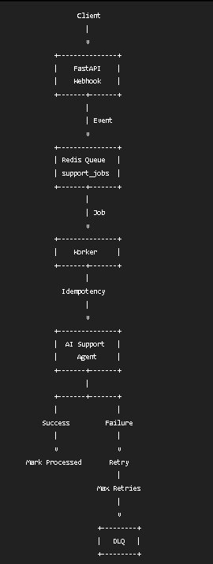

# Project 01: Structured Output Agent

**Goal** : A given query to LLM should generate Structured output 

User Input → LLM → Structured Output → Pydantic Validation → FlightRequest


# Project 02: RAG Agent with Citation Grounding

**Goal** : Retrieve context, generate answers with sources, flag low-confidence responses, fallback to search.


# Project 03: Multi-Tool Agent

**Goal** : A multi-tool agent that demonstrates tool orchestration, routing, parallel execution,
error handling, cost-aware model routing, and basic LLM usage tracking.


**Tool Registry** :  A centralized registry maintains the available tool
**Tool Routing**  :  The router analyzes the user's request and determines which tools are required.
**Tool Execution** : Independent tools can execute concurrently using ThreadPoolExecutor
                    Weather     ──┐
                                ├──> Aggregator
                    Calculator  ──┘
**Error Handling** : Tool failures are isolated from other tool executions. The successful result can still be returned instead of failing the entire request.
                Weather     → FAILED
                Calculator  → SUCCESS

**Result Aggregation** : Results from multiple tools are passed to an LLM which produces one final response.


**Cost-Aware Routing** : The system uses two models:
                     Simple requests are routed to the cheaper model.
                     Complex reasoning and architecture requests are routed to the stronger model.

**LLM Usage Tracking** : Basic metrics are collected for each LLM call:
                    model: openai/gpt-oss-120b
                    input_tokens: 82
                    output_tokens: 3072
                    reasoning_tokens: 257
                    total_tokens: 3154
                    latency_seconds: 6.985
                    cost_usd: 0.0018555

**Scope of the project** : Multi-tool agent architecture /  Tool registry pattern / LLM-based tool routing / Independent vs parallel execution / Tool-level error isolation
                       Result aggregation / Cost-aware model routing / Token-based cost calculation / LLM latency and usage tracking

                       Deferred : Langfuse Tracing / Dockerization / Production-grade retry and timeout policies / Cloud deployment


# Project 05: Stateful Memory + HITL Agent

A customer support agent that maintains conversation state, persists workflows, applies deterministic business rules, and requires human approval before executing a refund.

**Problem**

Customer support workflows often require:

- Conversation context
- Order information
- Business rules
- Human approval for sensitive actions
- Reliable state persistence

This project demonstrates these capabilities using LangGraph.

**Architecture**

```text
Customer Request
       ↓
Issue Detection
       ↓
Order Tool
       ↓
Refund Business Rules
       ↓
Eligible?
   ├── No → END
   │
   └── Yes
        ↓
   Human Approval
        ↓
   Approved?
    ├── No → END
    │
    └── Yes
          ↓
      Refund Tool
          ↓
         END


# Project 06: Event-Driven Agent Automation

An event-driven customer support agent that processes requests asynchronously using a Redis queue and background worker.

The project demonstrates how AI agent workloads can be decoupled from API requests and made more reliable using retries, idempotency, and a Dead Letter Queue (DLQ).

## Problem

AI agent calls can take several seconds and external services can fail temporarily.

If the API waits for the agent to finish synchronously:

```text
Client
  ↓
API
  ↓
AI Agent
  ↓
Response

the client is blocked while the agent is processing.
Instead, this project uses asynchronous processing:

Client
  ↓
FastAPI Webhook
  ↓
Redis Queue
  ↓
Background Worker
  ↓
AI Agent
  ↓
Result



Key Concepts
1. Event-Driven Architecture : The API creates an event when a customer submits a support request.
2. Producer and Consumer : The FastAPI application acts as the producer.It adds jobs
The worker acts as the consumer.It removes jobs

3. Asynchronous Processing : The API returns immediately, The actual AI processing happens in the background worker.
This prevents long-running AI operations from blocking the API request.

4. Retry: 
Temporary failures should not immediately fail the job.
The worker retries failed operations up to 3 times.
Retryable failures can include:

temporary API failures
timeouts
rate limits
temporary network failures


5. Idempotency
The same event may be delivered more than once.
The worker uses the event ID to prevent duplicate processing.
Two Redis keys are used:
processing:event_id : acts as a temporary processing claim.
processed:event_id ecords successful completion.
This prevents the same successful event from being processed multiple times.

6. Atomic Event Claiming
Redis SET with NX is used when claiming an event:
NX ensures that only one worker can claim the event when multiple workers attempt to process it concurrently.

The 60-second expiry acts as a temporary lease so a crashed worker does not hold the event forever.

7. Dead Letter Queue
If a job fails after all retry attempts, it is moved to: support_jobs_dlq