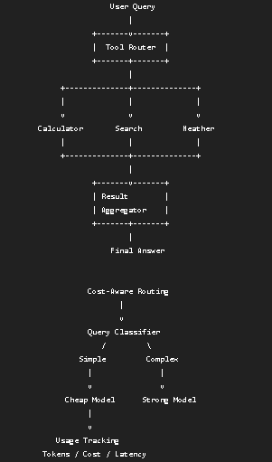

# Project 01: Structured Output Agent

**Goal** : A given query to LLM should generate Structured output 

User Input → LLM → Structured Output → Pydantic Validation → FlightRequest

# Project 02: RAG Agent with Citation Grounding

**Goal** : Retrieve context, generate answers with sources, flag low-confidence responses, fallback to search.

# Project 03: Multi-Tool Agent

**Goal** : A multi-tool agent that demonstrates tool orchestration, routing, parallel execution,
error handling, cost-aware model routing, and basic LLM usage tracking.

**Tool Registry** :  A centralized registry maintains the available tool
**Tool Routing**  :  The router analyzes the user's request and determines which tools are required.
**Tool Execution** : Independent tools can execute concurrently using ThreadPoolExecutor
                    Weather     ──┐
                                ├──> Aggregator
                    Calculator  ──┘
**Error Handling** : Tool failures are isolated from other tool executions. The successful result can still be returned instead of failing the entire request.
                Weather     → FAILED
                Calculator  → SUCCESS

**Result Aggregation** : Results from multiple tools are passed to an LLM which produces one final response.

**Cost-Aware Routing** : The system uses two models:
                     Simple requests are routed to the cheaper model.
                     Complex reasoning and architecture requests are routed to the stronger model.

**LLM Usage Tracking** : Basic metrics are collected for each LLM call:
                    model: openai/gpt-oss-120b
                    input_tokens: 82
                    output_tokens: 3072
                    reasoning_tokens: 257
                    total_tokens: 3154
                    latency_seconds: 6.985
                    cost_usd: 0.0018555

**Scope of the project** : Multi-tool agent architecture /  Tool registry pattern / LLM-based tool routing / Independent vs parallel execution / Tool-level error isolation
                       Result aggregation / Cost-aware model routing / Token-based cost calculation / LLM latency and usage tracking

                       Deferred : Langfuse Tracing / Dockerization / Production-grade retry and timeout policies / Cloud deployment
